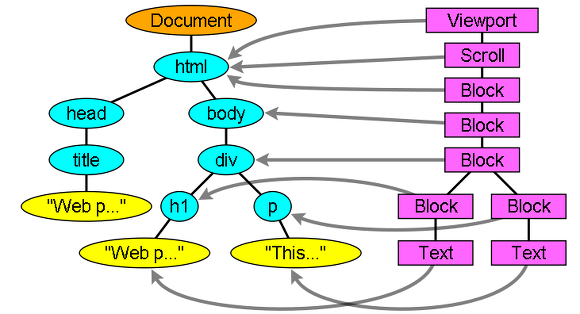

# Reflow와 Repaint

## 1. 개념
생성된 DOM 노드의 레이아웃 수치(너비, 높이, 위치 등) 변경 시 영향 받은 모든 노드의(자신, 자식, 부모, 조상(결국 모든 노드) ) 수치를 다시 계산하여(Recalculate), 렌더 트리를 재생성하는 과정이며 또한, Reflow 과정이 끝난 후 재 생성된 렌더 트리를 다시 그리게 되는데 이 과정을 Repaint 라 한다.

## 2. 현상 발생
Reflow와 Repaint는 브라우저 렌더링 과정의 일부이다. 그렇기 때문에 설명하기에 앞서 브라우저 렌더링에 대한 개념을 우선적으로 알아야 한다.  

### 2-1. 브라우저 동작의 이해

**1. 브라우저 랜더링**  
렌더링은 화면에 컨텐츠를 그리는 과정으로 브라우저에 UI를 그리는 것을 말한다.  
크롬의 경우, Webkit 엔진을 사용하여 렌더링하게 되는데, 간단하게 과정을 설명하자면,  
문서(html, css)를 파싱하여 렌더 트리를 생성하고 이를 배치 및 표현하게 된다.  
 
  

**2. 랜더트리**  
렌더 트리는 스타일 정보와 HTML 표시 규칙을 가진 객체다. 어찌보면 DOM 객체와 동일하다고 생각될 수 있는데, 비시각적인 요소는 렌더트리로 생성되지 않기 때문에 다르다고 말할 수 있다. (ex. style - display: none, <head> 등)
 
  
  
### 2-2. Reflow : 랜더트리 배치

크기와 위치에 맞게 브라우저에 배치하는 과정을 Reflow라고 힌다. 위치를 결정하는 방법에는 3가지가 존재힌다.  

- Normal: 문서의 위치에 따라 배치, DOM 트리와 동일  
- Float: Normal과 같이 배치된 후, 끝(왼 or 오른)으로 이동  
- Absolute: DOM 트리와 다른 자리에 배치  

**Reflow 과정이 일어나는 상황**  
+ 노드의 추가 또는 제거시.  
+ 요소의 위치 변경 시.  
+ 요소의 크기 변경 시.(margin, padding, border, width, height, 등..)  
+ 폰트 변경 과(텍스트 내용) 이미지 크기 변경 시.(크기가 다른 이미지로 변경 시)  
+ 페이지 초기 랜더링 시.(최초 Layout 과정)  
+ 윈도우 리사이징 시.  

**Reflow 발생 과정**  
1. Click 이벤트 handler  
2. Recalcurate(변경된 스타일 수치 계산 수행)  
3. Layout(Reflow 과정 수행)  
4. Paint(Repaint 과정 수행)  

### 2-3. Repaint : 랜더트리 표현

시각적인 요소가 표현되는 과정을 Repaint라고 한다. Reflow처럼 스타일의 모든 변경이 레이아웃 수치에 영향을 받는 것은 아니다.    
Repaint 표현이 되는 순서로는 아래와 같다.  
> 배경색 → 배경이미지 → 테두리 → 자식 → 아웃라인  

**Repaint 발생 과정**  
1. Click 이벤트 handler 
2. Recalcurate(변경된 스타일 수치 계산 수행) 
3. Paint(Repaint 과정 수행)

## 3. 최적화 방법

**1. 변경이 잦은 요소는 Absolute에 배치한다.**  
: 애니메이션이 들어간 노드는 가급적 position:fixed 또는 position:absolute로 지정하여 전체 노드에서 분리 시키도록 한다.  
보통 (JS(Javascript) + CSS)를 활용한 에니메이션 효과는 해당 프레임에 따라 무수히 많은 Reflow 비용이 발생하게 된다.  
하지만 position 속성을 "fixed" 또는 "absoute"로 값을 주면 지정된 노드는 전체 노드에서 분리된다. 
즉, 전체 노드에 걸쳐 Reflow 비용이 들지 않으며, 해당 노드의 Repaint 비용만 들어가게 된다. 
또한, 노드의 position 값을 초기에 적용하지 않았더라도 에니메이션 시작 시 값을 변경(fixed, absolute)하고 종료 시 다시 원복 시키는 방법을 사용해도 무관하다.  
 
**2. 스타일 변경은 한번에 묶어서 처리한다.**  
 
**3. 테이블은 점진적 배치에서 제외되기 때문에 사용을 지양한다.**  
: 테이블로 구성된 페이지 레이아웃은 점진적(progressive) 페이지 렌더링이 적용되지 않으며, 모두 로드되고 계산(Recalculate)된 후에야 화면에 뿌려지게 된다. 하지만 해당 테이블에 table-layout:fixed 속성을 주는 것이 디폴트값인 auto에 비해 성능면에서 더 좋다고 한다.  
 
**4. 스타일을 최적화한다.**  
─ CSS 하위선택자는 필요한 만큼만 정리하라.  
─ position:relative 사용 시 주의하자.  
─ cssText 및 클래스를 활용해 Reflow or Repaint 최소화하라.  
─ DOM과 스타일 변경을 하나로 묶어 리플로우 수행을 최소화 한다.

**[참고]**
- [Reflow or Repain(or ReDraw)과정 설명 및 최적화 방법](http://webclub.tistory.com/346)  
- [Reflow와 Repaint](http://heowc.tistory.com/83)
