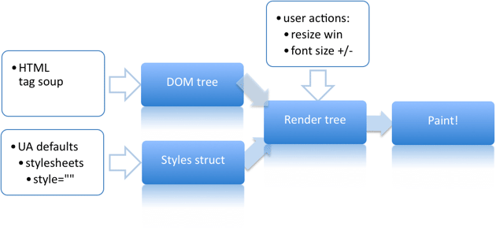

# Reflow와 Repaint

## 1. 개념
생성된 DOM 노드의 레이아웃 수치(너비, 높이, 위치 등) 변경 시 영향 받은 모든 노드의(자신, 자식, 부모, 조상(결국 모든 노드) ) 수치를 다시 계산하여(Recalculate), 렌더 트리를 재생성하는 과정이며 또한, Reflow 과정이 끝난 후 재 생성된 렌더 트리를 다시 그리게 되는데 이 과정을 Repaint 라 한다.

## 2. 현상 발생
Reflow와 Repaint는 브라우저 렌더링 과정의 일부 입니다. 그렇기 때문에 설명하기에 앞서 브라우저 렌더링에 대한 개념을 우선적으로 알아야 한다.  

### 2-1. 브라우저 동작의 이해

1. **브라우저 랜더링**  
렌더링은 화면에 컨텐츠를 그리는 과정으로 브라우저에 UI를 그리는 것을 말한다.  
크롬의 경우, Webkit 엔진을 사용하여 렌더링하게 되는데, 간단하게 과정을 설명하자면,  
문서(html, css)를 파싱하여 렌더 트리를 생성하고 이를 배치 및 표현하게 된다.  
  

2. **랜더트리**

### 2-2. Reflow 과정이 일어나는 상황

### 2-3. Repaint 과정이 일어나는 상황

## 3. 최적화 방법
