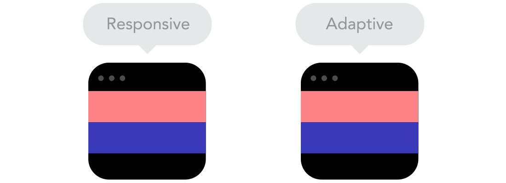

# 디자이너와 퍼블리셔가 함께하는 반응형 웹

> 2018/12/24, SAMY

## 1. 개요

반응형웹은 데스크탑, 노트북, 넷북, 태블릿, 스마트폰, 스마트TV 등 N-Screen의 Multi Device에 어떠한 사용자도 제약없이 접근할 수 있도록 제공하는 웹을 말한다.

## 2. 반응형 웹디자인의 특징

**반응형 웹디자인 vs 적응형 웹디자인**   
: 반응형 웹은 하나의 템플릿을 사용해 모든 기기에 대응하는데 반해, 적응형 웹은 선별된 기기 유형에 따라 별도의 독립적인 템플릿이 요구됩니다. 즉, 별도 페이지 제작이 필요합니다.  
쉽게 말해, 하나의 사이트로 PC와 모바일이 모두 접근 가능하다면 반응형인 사이트로 모바일 접속시에 'm' 또는 'mobile'이 붙는 새로운 주소로 변환 시는 적응형이라 할 수 있습니다.    
  

  
**상대적인 요소들 (Relative units)**   
: 반응형 웹의 가장 큰 목적은 각 디바이스에 적합한 환경을 유동적으로 제공하는 것입니다. 이를 위해서는 고정 단위인 'px'이 아니라 'vw, em, rem, %' 등의 상대 단위가 필요합니다.  
만약 모바일을 위한 작업에서 모든 단위를 px로 유지한다면 그림과 같이 viewport의 크기에 따라 컨텐츠가 잘리거나 모자라게 보일 수있습니다.    
  
  
**분기점 (Breakpoints)**   
: PC와 mobile은 viewport의 크기에 따라 레이아웃이 달라지는 것이 필수입니다. 그러다 보면 열(Column)의 개수도 달라집니다. 보통 pc보다 모바일이 열 개수가 적습니다.  
이때, 어디에서 열을 끊어줄 것인지를 미리 정해놓는다면 환경에 적합한 디자인이 완성될 것입니다.    
  
  
**최대값과 최소값 (Max and Min values)**   
   
  
**플로우 (Flow)**  
: 컨텐츠 크기 변화에 따라 주변에 함께 있는 컨텐츠의 흐름을 어떻게 할 것인가 정의합니다.  
그림과 같이, Flow로 둔다면 함께 움직이는 것이고 static으로 둔다면 주변 컨텐츠는 고정되고 해당 컨텐츠만 변화하게 됩니다.    
  
  
**웹폰트와 시스템 폰트 (Webfonts vs System fonts)**   
: 
   

  
## 3. 전략 (작업순서 및 고려사항)

+ **3-1. 모바일 환경을 우선하여 기획 및 디자인하기**  
: 이것은 모바일 환경을 먼저 디자인 하면 보다 효과적이고 창조적인 디자인을 할 수 있다는 전략입니다.  

+ **3-2. 디바이스 최소 사이즈 정하기**  
─ viewport 이해하기  
: vierport는 한마디로 지금 보고 있는 브라우저 창의 크기라고 할 수 있습니다. 정해진 바는 없으나 일반적으로 아래와 같은 기준애 따라 작업합니다.  
    + moible : 360px (최소 320 ~ 최대 768)
    + tablet : 768px (최소 718 ~ 최대 1279)
    + pc : 1280px (최소 1024 ~ 최대 1400)

+ **3-3. 분기점 정하기**

+ **3-4. 이미지 전략 세우기**  
    - 백터 이미지, 스마트 오브젝트의 사용
    : 웹 환경에서는 이미지 개수가 많을수록 많은 리소스를 잡아먹게 됩니다. 따라서 우리는 반응형 작업시 하나의 이미지로 여러 기기를 대응할 수 있는 방법을 선호합니다.  
    그래서 하나의 디자인 파일로 여러 기기에 대응이 가능하게 이미지를 추출해야 합니다. 이를 위해 이미지 파일은 최대한 크기 변형에도 문제 없는 스마트 오브젝트 사용을 권장합니다. (2배 사이즈 이미지)  

    > [제안] 아이콘이나 로고에 SVG 이미지를 사용하기  
    > [제안] 아이콘 글꼴 사용하기 ([ex. FontAwesome)](https://fontawesome.com/)  

    - 디바이스별 이미지 표시
    : 앞서 선택한 하나의 이미지로 여러 기기에 대응하는 방법으로는 아래 그림과 같이 각 디바이스마다 보여지는 부분이 다르게 됩니다.
    이 때에 디바이스별로 이미지를 어떻게 표현하는 것이 좋을지 선택해야 하고 아래와 같은 사항을 서로 상의하여 결정할 필요가 있습니다.
        * 이미지를 비율에 맞춰 표시할 것인가?
        * 높이는 고정하되 이미지 정렬을 가운데로 놓을 것인가? (이미지의 가운데가 보이고 외곽은 잘리게 됨)
        * 각 디바이스마다 이미지의 높이와 보여지는 부분을 다르게 설정할 것인가?
        * __디바이스별로 다른 이미지를 사용할 것인가?__  

      

+ **3-5. 텍스트 줄바꿈 정의하기**
: 디자인을 하다보면 문단 내에서 텍스트의 줄바꿈까지 세심한 디자인을 하게 됩니다. 그러나 반응형의 경우, 모바일과 태블릿, PC까지 모든 디바이스의 줄바꿈을 각각 다르게 디자인한다면  
유지보수에 어려움을 겪는 등의 비효율성을 초래할 수 있습니다. 따라서 텍스트 줄바꿈은 CSS를 이용하여 단어별로 묶어 끊을 수 있도록 권장합니다.  

+ [추가정보](https://brunch.co.kr/@chulhochoiucj0/8)  

  
## 4. 반응형 디자인 패턴 (레이아웃)

: 뷰포트 변경에 따라 그리드 변화를 고려하여 레이아웃을 디자인한다.

+ [유동형 (Mostly Fluid)](https://googlesamples.github.io/web-fundamentals/fundamentals/design-and-ux/responsive/mostly-fluid.html)  
+ [열 끌어놓기(Column Drop)](https://googlesamples.github.io/web-fundamentals/fundamentals/design-and-ux/responsive/column-drop.html)  
+ [레이아웃 시프터(Layout shifter)](https://googlesamples.github.io/web-fundamentals/fundamentals/design-and-ux/responsive/layout-shifter.html)  
+ [미세 조정(Tiny tweaks)](https://googlesamples.github.io/web-fundamentals/fundamentals/design-and-ux/responsive/tiny-tweaks.html)  
+ [오프 캔버스(Off canvas)](https://googlesamples.github.io/web-fundamentals/fundamentals/design-and-ux/responsive/off-canvas.html)  

> - 모바일에서 폰트 사이즈가 디바이스 넓이에 맞춰 비율대로 증가 할 수 있는가? 
> (vw 사용하여 가능하지만.. 정해진 폰트 사이즈로 보여질것인지 넓이에 따라 사이즈가 커저야 할 지 고민)
> - Hover&터치 효과 고려

  

## 5. 반응형 웹의 퍼블리싱 이슈

### 반응형웹 마크업 가이드 제작 전 고민사항

**미디어쿼리 해상도 분기문제**  
: 어느 포인트에서 해상도를 나눌 것인가? / 해상도기준(320,568,768,1024,1025~)  
─ [반응형 시안 내부 주요 분기점 자료](http://oingdoing.com/tips/all/img/rw_guideline.jpg)  
> **해상도 분기에 따른 컨텐츠크기 조정  
> max-width : 1024px 이상 일 경우 → 좌·우측 20px(총 40px)이상 유지  
> max-width : 1023px 이하 일 경우 → 좌·우측 10px이상 유지  

**해상도 분기에 따른 컨텐츠크기 조정**  
> max-width : 1299px → 1280px (실질 컨텐츠 : 1240px)  
> max-width : 1024px → 1024px (실질 컨텐츠, PC와 동일 크기 : 984px)  
> max-width : 1023px → 768px (실질 컨텐츠 : 748px)  
> max-width : 767px → 640px (실질 컨텐츠 : 620px)  
> max-width : 639px → 480px (실질 컨텐츠 : 460px (~360px 조정가능) )  
> max-width : 479px → 360px (실질 컨텐츠 : 340px)  
> max-width : 359px → 320px (실질 컨텐츠 : 300px)

**가변적 그리드 기반의 레이아웃**  
상단 자료 참고    

**상대단위 사용에 대하여(px to em/rem/vh/vw/%)**  
배율에 따른 px과 상대단위 변화    

**최소단위 뷰포트(320px)에서의 문제점 해결**  
미디어쿼리 뷰포트 구분하여 따로 스타일 지정  

[참고]
> [FROONT, "9 basic principles of responsive web design"](http://blog.froont.com/9-basic-principles-of-responsive-web-design/)  
> [Google Web Fundamentals, "반응형 웹 디자인 패턴"](https://developers.google.com/web/fundamentals/design-and-ux/responsive/patterns?hl=ko)  
> [디자인 아트, "반응형 디자인 패턴"](https://m.blog.naver.com/dartplus/221202644512)
